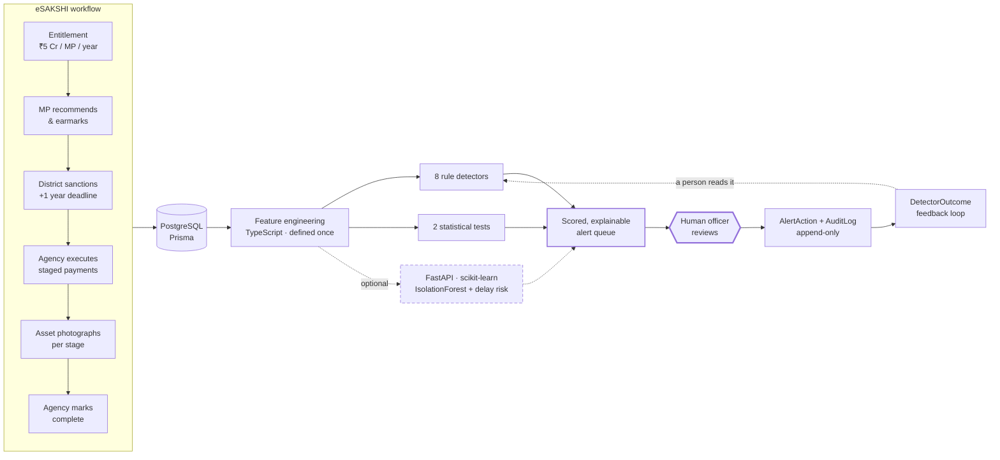

<div align="center">



### Smart India Hackathon 2026 · Problem Statement **26102**
**Ministry of Statistics and Programme Implementation** · Data Informatics & Innovation Division

`Software` · `Smart Automation` · Team **Technoverse**

<br>

**AI flags. A human decides.**
Every signal is a risk-prioritised prompt for review — never a finding of fraud.

</div>

---

## The problem

MPLADS moves **₹5 crore per Member of Parliament per year** through thousands of works, across every district in the country, executed by hundreds of implementing agencies. The eSAKSHI portal records all of it faithfully — recommendations, sanctions, staged vendor payments, asset photographs, completion marking.

Recording is not the same as *reading*. Nobody can read it all, so the hard questions go unasked:

<table>
<tr><td width="34%"><b>🕐 Which works are stuck?</b></td><td>A work must be completed within <b>one year of sanction</b>. Nobody is watching the clock on thousands of them at once.</td></tr>
<tr><td><b>💸 Is the money ahead of the work?</b></td><td>Payments are released in stages. A work 20% built and 85% paid looks exactly like one that is fine — until someone compares the two numbers.</td></tr>
<tr><td><b>📷 Was anything actually built?</b></td><td>Agencies upload asset photographs at each payment stage. A stage released with nothing on record is invisible unless somebody opens that work.</td></tr>
<tr><td><b>👻 Finished, but invisible</b></td><td>Only works an agency has <i>marked complete</i> show as completed. The portal itself notes that districts are "continuously pursued" to get this done — completed assets sit unrecorded for months.</td></tr>
<tr><td><b>🔁 Paid for twice?</b></td><td>The same asset, same locality, recommended again months later under slightly different wording.</td></tr>
<tr><td><b>📅 The March rush</b></td><td>A year's unspent balance committed in the final fortnight, at a rate no ordinary year would produce.</td></tr>
</table>

**And the one no rule can catch:** a work costly but *just* under the outlier threshold, slow but *just* inside the year, paid ahead but *just* under the gap, on a payment schedule no rule examines. Nothing fires. Everything comfortably under every limit — which is what deliberate gaming actually looks like.

---

## The solution



Three layers of evidence, **in order of how much each one needs** — and a human at the end of all of them.

| Layer | What it does | Needs |
|---|---|---|
| **8 rule detectors** | Every one traces to a real step of the eSAKSHI workflow and cites the rule it applies. Overdue completion · payment ahead of progress · cost overrun · entitlement breach · missing asset evidence · complete-but-unmarked · duplicate works · year-end clustering | *Nothing* |
| **2 statistical tests** | Cost outliers by median-absolute-deviation against comparable works; agency concentration by binomial tail probability — *is this split surprising?*, not *is it above 45%?* | *Nothing* |
| **IsolationForest** | 11 engineered features. Finds works unusual **in combination** — precisely the ones a rule-by-rule check cannot see | Python service |
| **Delay-risk model** | Will this running work miss the one-year mark? Uses only what was known at sanction, so it cannot read the outcome it predicts | Python service |

> **The model service is optional by design.** `ML_MODE=rules` skips it; `ML_MODE=ml` calls it and treats any failure as *"no model signals this run"*. **134 of 174 alerts need no Python at all.** An oversight platform that goes dark because a model server restarted is worse than one with no model.

---

## Why we are different

<table>
<tr>
<td width="50%" valign="top">

### 🧾 Every alert is a reviewable case

Not a score. Not a red flag. Four things, always:

1. **The reason**, in a sentence, with real figures
2. **The rule**, stated in words, with its threshold
3. **The records** it read, breaching row marked
4. **The score, itemised** — each weighted component, its basis, its contribution, adding up in front of the reader

An officer should be able to *disagree* from that page alone.

</td>
<td width="50%" valign="top">

### 🔒 RBAC is a query filter, not a hidden button

`scopeFor(user)` returns a `where` fragment carried by **every** query. A missing jurisdiction yields `DENY_ALL` — the failure mode is *see nothing*, never *see everything*.

Proved by forging the hidden `alertId` in a live browser to reach another district's alert. The server refused; the foreign alert stayed untouched. **That test ships.**

</td>
</tr>
<tr>
<td valign="top">

### 🧭 We publish our own mistakes

The delay model first scored **AUC 0.98** — a leak, not a result: *days past the deadline* was in its input. It was reading the answer. Rebuilt on sanction-time attributes only, the honest figure is **0.75**, and a test now blocks the leak returning.

An accessibility pass caught severity badges at **2.70:1** contrast. A duplicate detector matched boilerplate at 91%. All fixed, all written down.

</td>
<td valign="top">

### ⚖️ Nothing accuses anyone

No alert closes itself. Every state change carries a name. Three of four actions require a written reason. There is no transition back to "untouched" — a decision is answered by recording another, never by erasing it.

`npm run tune` reads reviewer outcomes back, and **changes nothing**. A detector that retunes itself from reviewer behaviour learns to stop reporting whatever is inconvenient.

</td>
</tr>
</table>

---

## Architecture





Feature engineering stays in **TypeScript**, shared with the rule detectors, so there is one definition of "payment-to-progress gap" in the codebase. The Python service receives work ids and numbers — **no scheme logic, no names, no personal data**.

---

## One filter, five jurisdictions



All five roles call the **same** scope-filtered queries. Only the `Scope` differs — there is no "national mode" switch to get wrong.

| Role | Dashboard answers | Can act on alerts |
|---|---|:-:|
| **Ministry / MoSPI** | Which states carry the most risk? | ✅ |
| **State Nodal Authority** | Which district do I chase? | ✅ |
| **District Authority** | What can I fix today? | ✅ |
| **Member of Parliament** | What did my entitlement buy? | ❌ |
| **Implementing Agency** | What do I still owe? | ❌ |

An agency marking its own missing-evidence alert as "explained" would make the entire audit trail worthless — so it cannot.

---

## Results

<div align="center">

| | Rule detectors | Statistical | IsolationForest |
|---|:-:|:-:|:-:|
| **Precision** | **100%** | 100% | *not reported — see below* |
| **Recall** | **100%** | 86% / 100% | **100%** on multivariate-only cases |
| **Alerts** | 118 | 16 | 40 |

**968 works · 2,162 payments · 4,274 evidence files · 146 ground-truth labels · 6 states · 36 districts**

</div>

> **What that 100% is worth.** The seed and the detectors were built to the same definition of each rule, so a perfect score is what *two correct implementations* look like. It is a **regression test**, not an accuracy claim — and the README says so rather than leading with the number.

**`npm run eval` deliberately reports no precision for the IsolationForest.** It is pointed at cases no rule covers, so scoring it for failing to reproduce the rule labels would report 0% *for doing its job*. What is reported instead: of 12 works planted as unusual-only-in-combination, it found **all 12**, and 7 of its 8 solo flags were exactly those.

<div align="center">

| Suite | Tests | Covers |
|---|:-:|---|
| `npm test` | **79** | RBAC isolation · detectors · dashboards · review state machine · ML leakage guards |
| `npm run test:e2e` | **21** | Review workflow through a real server action · export scoping · **WCAG 2.1 AA on every page** · keyboard · हिन्दी |
| `npm run ml:test` | **12** | Model service — refusing to guess on thin data, explanations matching what drove each score |

</div>

---

## Data provenance — read this first

> ### ⚠️ The dataset in this repository is **synthetic**.
> It is generated locally by `prisma/seed.ts` and labelled as synthetic in the database, in a **banner on every authenticated page**, and here.

| | |
|---|---|
| **Real** | State, district and constituency names — so the platform looks and behaves like the deployed thing |
| **Fictional** | Every Member of Parliament, official, implementing agency and vendor. Every rupee figure, work, payment and date |
| **Not reproduced** | Any official MPLADS record. No figure here is sourced from MoSPI |

Planted anomalies are attached **only to fictional entities**. No real person or organisation is associated with any risk signal in this build — attaching invented fraud signals to real names would be defamatory, and no demo is worth that.

**Coverage gap.** eSAKSHI holds MPLADS data from **1 April 2023** onward. For the 17th Lok Sabha, FY 2019-20 to 2022-23 is not on the portal, and Rajya Sabha details are unavailable before FY 2023-24. The seed mirrors that window rather than fabricating earlier history, and the UI states the gap wherever history is shown.

**Swapping in real data.** The detectors read Prisma models, not the seed. An eSAKSHI feed plugs in by writing to the same tables and inserting a `DataSource` row with `kind = REAL`. Every figure in the UI renders its source and date from that row, so real and synthetic cannot be confused.

---

## Run it

Requires **PostgreSQL** and **Node 18+**. No network access needed after install — the font is self-hosted and the app reads only from the local database.

```bash
npm install
cp .env.example .env            # set DATABASE_URL and SESSION_SECRET
                                # openssl rand -base64 48
createdb satarkai
npm run db:push                 # apply the schema
npm run db:seed                 # generate the synthetic dataset
npm run detect                  # run the detectors — no Python needed
npm run dev                     # http://localhost:3000
```

<details>
<summary><b>Optional: the model layer</b></summary>

```bash
npm run ml:setup     # venv on Python 3.13 + pinned dependencies
npm run ml:serve     # in a second terminal
npm run detect:ml    # now includes IsolationForest and delay forecasts
```

Python **3.13** specifically — 3.14 has broken pydantic builds. `npm run ml:setup` pins it.

</details>

<details>
<summary><b>Demonstration accounts</b> — password <code>satark@2026</code></summary>

| Email | Role | Sees |
|---|---|---|
| `ministry@mospi.demo` | Ministry / Central Nodal Agency | Every state |
| `sna.gj@demo.gov` | State Nodal Authority | Gujarat, all districts |
| `district.gj-ahd@demo.gov` | District Authority | Ahmedabad district |
| `mp.gj@demo.gov` | Member of Parliament | Own recommended works |
| `ia.gj-ahd@demo.gov` | Implementing Agency | Own assigned works |

Substitute the state code (`gj`, `mh`, `up`, `tn`, `wb`, `as`) for other states. Each account sees only its own jurisdiction — that is the point of them.

</details>

<details>
<summary><b>All commands</b></summary>

| Command | Does |
|---|---|
| `npm run dev` / `build` / `start` | Next.js |
| `npm run db:push` / `db:seed` / `db:reset` | Schema and synthetic data |
| `npm run detect` / `detect:ml` | Run the detectors, reconcile the alert queue |
| `npm run eval` | Score the detectors against planted ground truth |
| `npm run check:baseline` | Verify the seed's clean baseline and chronology |
| `npm run tune` | Read the reviewer feedback loop back |
| `npm test` / `test:e2e` / `ml:test` | The three test suites |
| `npm run ml:setup` / `ml:serve` | The Python model service |
| `npm run typecheck` / `lint` | `tsc --noEmit` / `next lint` |

</details>

---

## Stack

<div align="center">

`Next.js 14` · `TypeScript (strict)` · `Tailwind` · `PostgreSQL` · `Prisma` · `Recharts`
`FastAPI` · `scikit-learn` · `Python 3.13` · `Playwright` · `Vitest` · `axe-core`

</div>

Session cookies signed with `jose` (httpOnly, `secure` in production, `sameSite=lax`, configurable expiry); bcrypt password hashing; no secrets in the repository.

**Accessibility is checked, not claimed.** axe runs against every page in the e2e suite and fails the build on any violation — currently **zero** across all seven pages plus the work drill-down. It caught the severity badges failing contrast as small text on its first run; no amount of looking at the page would have.

**Charts follow a validated palette.** Colour is assigned by the job it does, run through an OKLCH/CVD validator rather than chosen by eye. Severity colour stays reserved for risk — a chart never borrows it for "the third line".

---

## Honest limitations

We would rather you read these from us than find them yourselves.

- The dataset is **synthetic**. Detector accuracy on it says something about the detectors and nothing about real MPLADS execution.
- The **100% rule-detector figure is a regression test**, not a real-world accuracy claim.
- The **delay model's AUC (0.75)** describes how well it recovers relationships *this project wrote into the seed* — agency reliability, work-type complexity, monsoon slippage. Real delay has its own structure.
- The delay model sees **nothing after sanction**, because this dataset records only a work's current progress. A real eSAKSHI feed carries staged progress updates.
- Thresholds other than the **365-day rule** are review triggers chosen for this build. They need tuning against real reviewed outcomes.
- `IA_CONCENTRATION` and `COST_OUTLIER` are **statistical signals**. A dominant agency may simply be the only one in the district competent to do the work.
- **Hindi covers the interface, not generated content.** Alert reasons stay in English until the detectors emit message keys rather than finished sentences. The Hindi has not been reviewed by a native administrative-Hindi speaker.
- `NOTIFY_MODE=console` is the default and **no SMTP transport is implemented**, so email is recorded as *skipped*, not sent. SMS and IVR are deliberate stubs that record intent.
- Anomalies are spread evenly across all 36 districts, so a **single district dashboard shows only a handful**. Realistic, but it makes the District role look emptier than a real one would.
- **No detector output is evidence of wrongdoing.**

---

## Further reading

| Document | What it covers |
|---|---|
| [`docs/ENGINEERING.md`](docs/ENGINEERING.md) | The full engineering account — every design decision and the mistakes behind it |
| [`docs/SCHEME.md`](docs/SCHEME.md) | The MPLADS workflow, and the citation behind every rule |
| [`ml/README.md`](ml/README.md) | The model service: why unsupervised, why ablation, why so few features |

<div align="center">
<br>

**Team Technoverse** · Smart India Hackathon 2026
Problem Statement 26102 · MoSPI · Data Informatics & Innovation Division

<sub>Reference portal — <a href="https://mplads.mospi.gov.in/digigov/dashboard.html">mplads.mospi.gov.in</a></sub>

</div>
